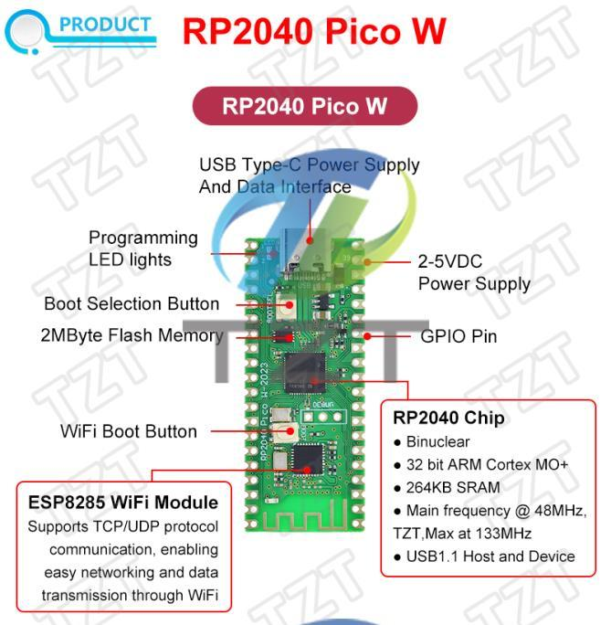

# RP2040 Pico W 2023
Oživení a použití atypického WiFi modulu klonu

## Historie projektu

Podrobnější historie toho, proč jsem se začal problematice věnovat, uvádím v [článku na svém webu](https://4pc.webnode.cz/news/raspbery-pi-pico-w-2023/), nebudu to zde tedy opakovat. Ve zkratce: **RP2040 Pico W 2023** je čínský klon desky od Raspberry, bohužel je ale na ní osazen jiný čip, řešící WiFi připojení, který navíc neumožňuje připojení Bluetooth. Připojení WiFi je tedy možné pomocí AT modemu, který zajišťuje na klonu osazený MCU ESP8285, který má již od výroby (alespoň tedy moje dvě Pi to tak měly) zaveden FW [SDK V2.2.1](https://ieee-sensors.org/wp-content/uploads/2018/05/4a-esp8266_at_instruction_set_en.pdf).
